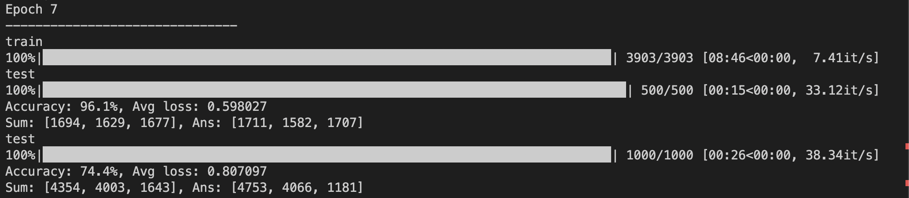
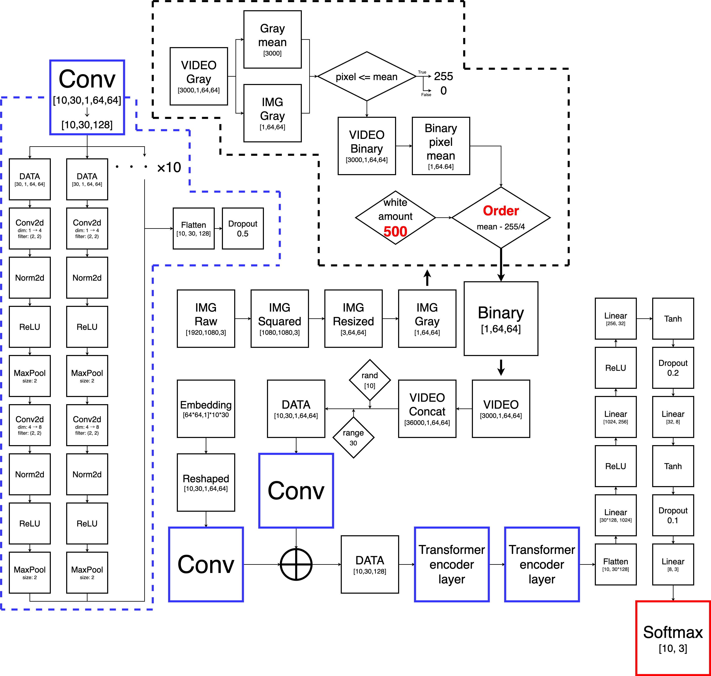

## What is predict_dance ?
***predict_dance*** is enable to decide which videos belong to ***[elegant, dance, other]***.

<table>
  <tr><th>\</th><th>resize</th><th>gray</th><th>binary</th><th>limit</th></tr>
  <tr>
    <th>elegant</th>
    <td></td>
    <td></td>
    <td></td>
    <td></td>
  </tr>
  <tr>
    <th>dance</th>
    <td></td>
    <td></td>
    <td></td>
    <td></td>
  </tr>
  <tr>
    <th>other</th>
    <td></td>
    <td></td>
    <td></td>
    <td></td>
  </tr>
</table>
then, you can get result of video prediction.



## How do I start ?
first of all, you need to install **dependencies**.<br>
you should type this command.
```
pip install -r src/git/requirements.txt
```
next, you need to create directories.<br>
plz check tree down below.
<pre>
.
├── archive
│   ├── *.mp4 (for stock)
├── out
│   ├── video
│   │   ├── edited
│   │   │   ├── *.mp4
│   │   ├── removed
│   │   │   ├── *.mp4
│   ├── img (this directory is created automatically)
│   │   ├── epoch_n
│   │   │   ├── ...
│   ├── model
│   │   ├── ...
│   └── src
│       ├── ...
├── src
│   ├── py
│   │   ├── __pycache__
│   │   │   ├── *.pyc
├── test
│   ├── *.mp4 (for test)
└── video
    ├── *.mp4 (for prediction)
</pre>
Finally, you checkout branches.<br>
if you type these command, you can execute prediction.
```
python main.py
```
```
python test.py
```

you can modify code everything. plz read my code and improve better!<br>
I show you recent nn and old repos for help.
[pre1](https://github.com/jasmine-jp/predict_dance)
[pre2](https://github.com/jasmine-jp/predict_dance2)
## flow chart

